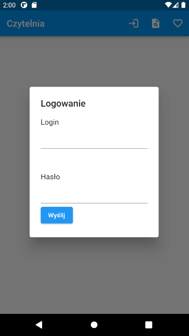
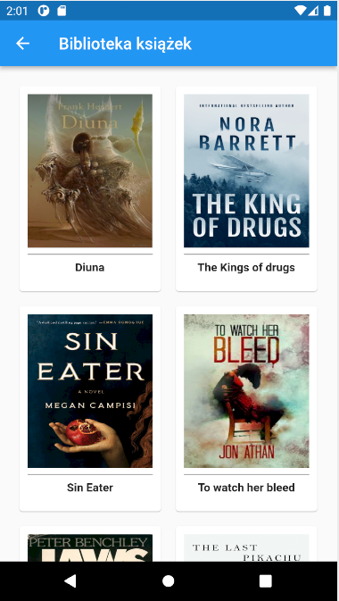
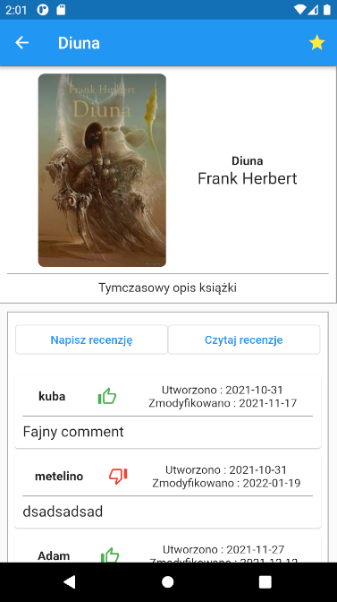

# Czytelnia

An app for reading e-books for android.

## Table of Contents
* [General Info](#general-information)
* [Technologies Used](#technologies-used)
* [Features](#features)
* [Pictures](#pictures)
* [Setup](#things tom improve)
* [Things to improve](#todo)

## General Information

An android app that allows you to browse a library of free books.
This app is supposed to run in concjution with REST backend: https://github.com/Metelino/Czytelnia_backend. 

## Technologies Used

- Dart - version 2.14.4
- Flutter - 2.5.3

## Features

- create account, browse library of books
- rate books, write reviews
- mark books as favorite, quick access to favorite books
- read books, cache books for offline reading

## Pictures

Signing in

 

Searching books

 

Book reviews

 

Favorite books

 

Reading a book (temporary lorem ipsum)

## Setup
Dart and Flutter are required.\
Change directory to project folder and run: `flutter create .` to build app for all platfroms.
To install all deps change directory to project folder and run: `flutter pub get`\
To start debug type: `flutter run lib/main.dart` and choose device for emulation (android recommended).

## Things to improve
At the moment there is no functionality to search books by name of author.
